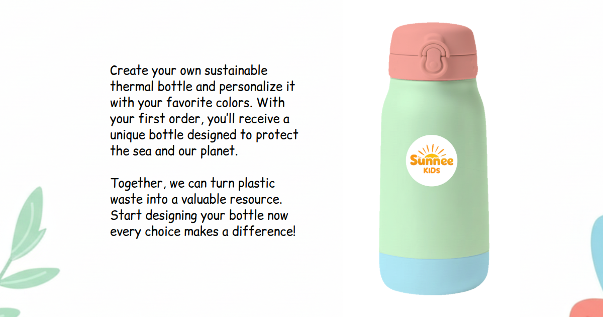

# Sunnee – Sustainable Kids Bottle Configurator

Welcome to Sunnee, the interactive web app for customizing your own sustainable kids bottle! 🌊

## Preview



## Live Demo

👉 [Try the Demo](https://sunnee.vercel.app/)

## Project Overview
Sunnee is a Vue.js application designed to raise awareness about recycling and sustainability among children. With Sunnee, users can personalize the cap, body, and bottom colors of their eco-friendly bottle and see a real-time preview before confirming their choice.

### Features
- **Step-by-step configurator**: Choose the color of each bottle part in a guided flow.
- **10 color options**: Select from a palette of predefined, vibrant colors.
- **Live preview**: See your bottle update instantly as you pick colors.
- **Welcome & Thank You pages**: Friendly onboarding and creative closing.
- **Responsive design**: Optimized for both desktop and mobile devices.

## Tech Stack
- [Vue 3](https://vuejs.org/)
- [Pinia](https://pinia.vuejs.org/) (state management)
- [Vite](https://vitejs.dev/) (build tool)
- [Tailwind CSS](https://tailwindcss.com/) (utility-first CSS)

## Getting Started
1. Clone the repo:
  ```sh
  git clone https://github.com/your-username/sunnee.git
  cd sunnee
  ```
2. Install dependencies:
  ```sh
  npm install
  ```
3. Run the development server:
  ```sh
  npm run dev
  ```
4. Open [http://localhost:5173](http://localhost:5173) in your browser.

## License
MIT

---

Made with ❤️ by the Simone Camerano.
